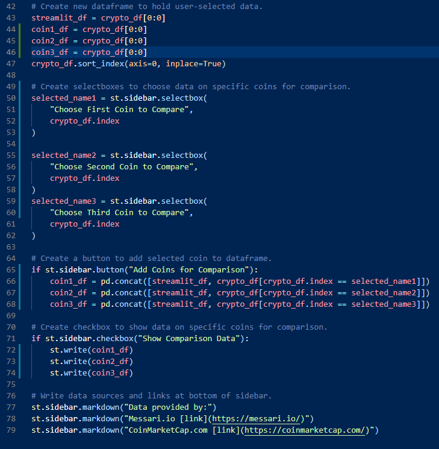

# Crypto Analysis Final Project 

Ryan Scott & Kevin Rodriguez

Software utilized:

  •	Jupyter Notebook
  
  •	Virtual Studio Code
  
  •	Tableau
  
  •	Streamlit

This project is an attempt to analyze cryptocurrencies qualitatively. This technology is still very young and the general public is largely ignorant of the capabilities of these assets. They are primarily treated as speculative assets, and as such there is already a large amount of technical trading data available online. However, there is very little aggregated information on the fundamental value of these assets.

There are thousands of coins now in existence, so it's no small task to evaluate and compare them, but luckily there are API's that have the useful info we needed, particulary Messari.io. We also accessed CoinMarketCap.com for recent price and volume data.

Because we used Streamlit, this project is divided into two files: one for the API pulls and data parsing that produces csv files to work with locally, the other to run the Streamlit application with the CSV file data. We began with everything in a single file, however every time a Streamlit option changed, it refreshed and caused another API pull. It wasn't long before we had exhausted our day's allowance of pulls. Thus, we divided them into 2 files.

The first file, `api_data_parse.py`, imports the libraries and dependancies, pulls from the API's, and parses the data to create two csv files, one with quantitative measures, the other with coin profile data and links.

The second file, `st_crypto_value.py`, reads the csv's into dataframes that are used to construct the Streamlit app. We created selectboxes to filter by category and sector, the latter being a subgrouping of the former, and when the corresponding checkboxes were selected, the dataframes filtered by those selections and displayed that dataset along with a chart comparing the Vlad Club Cost for each coin in that group.

The Vlad Club Cost is the cost of purchasing 0.01% of the full eventual supply of a currency. This represents a relative value opportunity, particularly at the enterprise level, if there is a coin/platform with useful functionality for which a large portion of the full supply can be purchased at a reasonable price. This also needs to be measured against the coins' market cap rank, though, as many coins are very cheap, but also have very low chances of widespread adoption, and will thus eventually be worthless.

Below the category and sector filters are three selectboxes containing all of the coins listed in the csv's. You can select different coins to compare here and use the checkbox to display their data side-by-side.

Finally, at the bottom of the sidebar, there are links to the API's used in this project.

